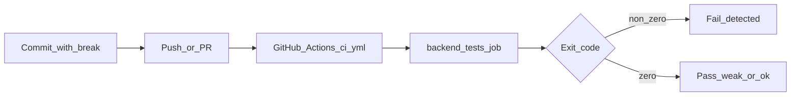

# CI で不具合検知を確認する計画

## 現在完成しているテストの整理

| 種別 | ファイル | 内容 |
|------|----------|------|
| Unit | [`backend/tests/Unit/ExampleTest.php`](backend/tests/Unit/ExampleTest.php) | `assertTrue(true)` のみ。**アプリの挙動は検証しない**（常に成功）。 |
| Feature | [`backend/tests/Feature/ExampleTest.php`](backend/tests/Feature/ExampleTest.php) | `GET /` が `/blade/hello` にリダイレクトすることを確認。 |
| Feature | [`backend/tests/Feature/ResearchSampleApiTest.php`](backend/tests/Feature/ResearchSampleApiTest.php) | **RefreshDatabase + `ResearchSampleSeeder`** のうえで、(1) `GET /api/hello` の JSON `message`、(2) `GET /api/items` の件数・各 `name`、(3) `GET /blade/hello` の表示文字列を検証。**ここが「DB と API/Blade の契約」を押さえている本命**。 |

テスト実行環境は [`backend/phpunit.xml`](backend/phpunit.xml) で **SQLite メモリ**（`DB_DATABASE=:memory:`）に固定されており、README の Docker 手順と CI は同じ `php artisan test` 系で整合しています。

## 現在の CI/CD

[`/.github/workflows/ci.yml`](.github/workflows/ci.yml)（`push` / `pull_request` 時）:

- **backend-tests**: `backend` で `composer install` → `.env` 準備 → **`php artisan test`**
- **frontend-checks**: `npm ci` → `lint` → `build`

ゴールの「変更による不具合を検出」は、**backend-tests が赤くなるか**が直接の指標になります（フロントは lint/build の別軸）。

## 手順①「バックエンドテストを1つ用意」について

**すでに「1本以上の意味のあるバックエンドテスト」は存在します**（`ResearchSampleApiTest` の3メソッド）。追加実装は必須ではありません。

- **検証実験だけなら**: 新規テストを書かず、既存の `ResearchSampleApiTest` を「本命」として手順②に進めて問題ありません。
- **研究レポート用に「テストを1つ追加した」と明記したい場合のみ**: 例として `ResearchSampleApiTest` にメソッドを1つ足す、または `tests/Feature` に単一メソッドのテストクラスを1つ作る、のどちらかで十分です（中身は既存と重複しない断言1つに絞ると説明しやすい）。

## 手順② わざと壊す（おすすめの壊し方）

**テストは触らず、アプリ側だけ**を一時的に壊すと、「CI が本当に検知したか」が明確です。

| 壊し方 | 変更箇所の例 | 期待される失敗 |
|--------|----------------|------------------|
| A（おすすめ） | [`ResearchSampleSeeder`](backend/database/seeders/ResearchSampleSeeder.php) の `message` 文字列を1文字でも変える | `test_api_hello_returns_message_from_database` および Blade テストが失敗 |
| B | 同 seeder の `Item` の `name` を変える | `test_api_items_*` / Blade が失敗 |
| C | API ルートやコントローラで 500 や別 JSON を返す | 該当 Feature テストが失敗 |

**「テストが弱い」と判定されるパターン**: 壊したのに `php artisan test` が緑のまま → その変更経路をカバーするアサーションが不足している（例: Unit の `assertTrue(true)` だけではほぼ何も検知しない）。

## 手順③ CI を実行して解釈

1. 壊したコミットを **`push` するか PR を作る**（[`ci.yml`](.github/workflows/ci.yml) がその両方で動く）。
2. GitHub の **Actions** タブで `research-app-ci` の **`backend-tests`** を開く。
3. **解釈**:
   - **`backend-tests` が失敗** → 今回の手順の「検証成功」（自動テストが不具合を検出した）。
   - **成功のまま** → 壊し方がテストから外れているか、テストが弱い（上記 C でルートを変えたのにテストが無い、など）。

ローカルだけ先に確認する場合は README 通り `docker exec ... php artisan test` または `backend` で `php artisan test`（PHP/Composer が入っていれば）で同じ結果を再現できます。

## +α: テスト結果をログとして残す

GitHub Actions 上では失敗ジョブの **ログ本文**が既に保存されます。さらに「成果物ファイル」として残すなら例は次のとおりです。

- **`php artisan test` に JUnit 出力**（Laravel は PHPUnit ラッパー）: 例 `--log-junit junit.xml`（正確なオプション名は実行環境の `php artisan test --help` で確認）。
- その XML を **`actions/upload-artifact`** でアップロードすれば、後からダウンロード可能。

実装時は [`ci.yml`](.github/workflows/ci.yml) の `Run Laravel tests` ステップのみの変更で足ります（他ジョブは触らない方針で十分）。

## 注意（スコープ）

- フロントエンドの **ユニット/E2E テスト**は現状の CI には含まれていません（`lint` / `build` のみ）。今回のゴールが「バックエンドの回帰検知」に絞られるなら、上記の手順で十分です。
